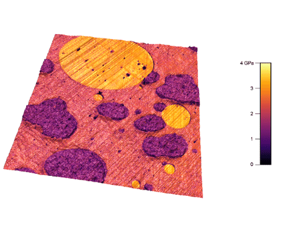

 

### MRI Guided Precise Interventional Robot

---
### Tunable Resonance Actuators for Magnetic Resonance Elastography

---

### Smart Tendon Hammer for Neuromodulation
<a href="TTAP.md">

 ### Microscale Mechanical Property Imaging
 

 

 
### Semi-Passive Exoskeleton Actuators

---
### Personal Projects

<a href="Personal.md">

